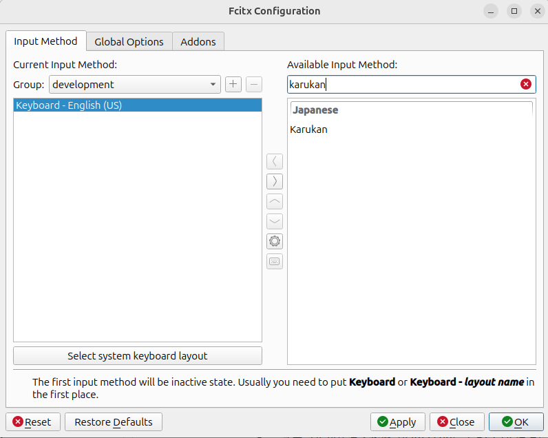
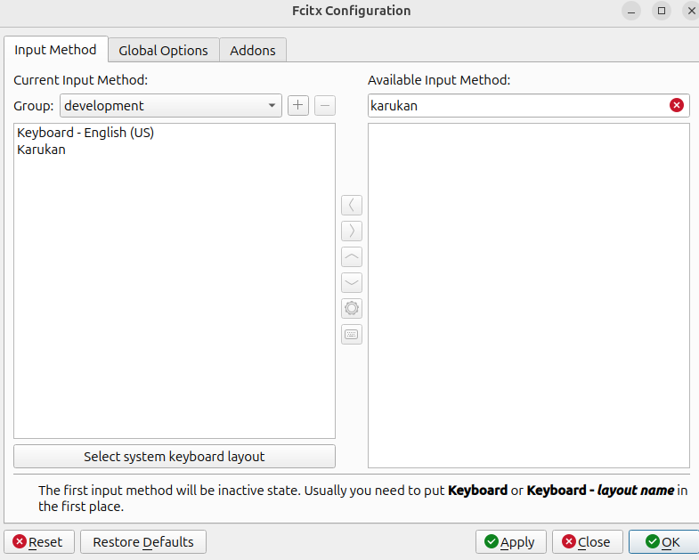

# karukan-im

Linux向け日本語IME。fcitx5上で動作し、GPT-2ベースのモデルでニューラルかな漢字変換を行います。

## Features

- ニューラルかな漢字変換（llama.cppによるGGUF推論）
- 変換学習（ユーザーの変換履歴を記憶し、完全一致・前方一致で候補を優先表示）
- 日本語・英数字の混合入力（Shift切り替え）
- Surrounding Textによる文脈を考慮した変換
- システム辞書・ユーザー辞書による候補補完

> **Note**: モデル推論だけでは語彙が限られるため、システム辞書の併用を強く推奨します。システム辞書はIMEに同梱されていないため、別途インストールが必要です。詳しくは [Dictionary](#dictionary) を参照してください。

## Install

### Prerequisites

```bash
sudo apt install fcitx5 fcitx5-modules-dev libfcitx5core-dev \
    libfcitx5config-dev libfcitx5utils-dev extra-cmake-modules \
    cmake build-essential
```

### Build & Install (システムインストール)

`/usr` にインストールします。sudo が必要ですが、`FCITX_ADDON_DIRS` の設定は不要です。

```bash
cd karukan-im/fcitx5-addon
cmake -B build -DCMAKE_INSTALL_PREFIX=/usr
cmake --build build -j
sudo cmake --install build
fcitx5 -r
```

### Build & Install (ユーザーローカル)

`~/.local` にインストールします。sudo 不要です。ビルド・インストール・設定ファイルのコピー・`FCITX_ADDON_DIRS` の設定をまとめて行います。

```bash
./install-local.sh
```

スクリプトは以下を行います:
- `~/.local` に fcitx5 アドオンをビルド・インストール
- `~/.config/environment.d/fcitx5-karukan.conf` を作成（`FCITX_ADDON_DIRS` の設定）
- `~/.config/karukan-im/config.toml` にデフォルト設定をコピー（既存の場合はスキップ）
- `~/.local/share/karukan-im/user_dicts/` にデフォルトユーザー辞書をコピー（既存の場合はスキップ）
- fcitx5 を再起動

インストール後、fcitx5-configtool（Fcitx Configuration）を開き、右側の「Available Input Method」で「karukan」を検索して「Karukan」を左側に追加してください。





> **Note**: 初回起動時にHuggingFaceからGGUFモデルを自動ダウンロードするため、起動に数分かかる場合があります。2回目以降はキャッシュ済みのモデルが使われます。

## Key Bindings

### ひらがな入力モード

| キー | 動作 |
|------|------|
| 文字キー | ローマ字入力 → ひらがな変換 |
| Space / Tab / ↓ | かな漢字変換を開始 |
| Enter | ひらがなのまま確定 |
| Escape | 入力をキャンセル |
| Backspace | 1文字削除 |
| Delete | カーソル位置の文字を削除 |
| ← → | カーソル移動 |
| Home / End | カーソルを先頭 / 末尾に移動 |
| Ctrl+K | カタカナモードに切り替え |
| Ctrl+Space | 全角スペースを入力 |

### 変換モード

| キー | 動作 |
|------|------|
| Space / Tab / ↓ | 次の候補 |
| ↑ | 前の候補 |
| 1-9 | 候補を番号で選択・確定 |
| Enter | 選択中の候補を確定 |
| Escape | 変換をキャンセル（ひらがなに戻る） |
| 文字キー | 選択中の候補を確定して新しい入力を開始 |

### モード切り替え

| キー | 動作 |
|------|------|
| Shift+英字 | 英数字モードに切り替え + 大文字入力 |
| Ctrl+K | カタカナモードに切り替え |
| Right Super | 英数字/カタカナ → ひらがなモードに復帰 |
| Ctrl+Shift+L | ライブ変換のON/OFF |

### 英数字モード

英数字モードでは文字がローマ字変換されず、そのまま入力されます。日本語と英語を混ぜて入力し、Spaceで変換するとひらがな部分のみ変換されます。

例: `わたしはLinuxが` → 変換 → `私はLinuxが`

## Configuration

設定ファイル: `~/.config/karukan-im/config.toml`

```toml
[conversion]
strategy = "adaptive"           # 変換ストラテジー（adaptive / light / main）
num_candidates = 9              # 変換候補数（Space押下時）
n_threads = 4                   # 推論スレッド数（0 = 全コア使用）
model = "jinen-v1-small-q5"     # メインモデル（モデルID or GGUFパス）
light_model = "jinen-v1-xsmall-q5"  # 軽量モデル（ビームサーチ・長文用）
use_context = true              # Surrounding Textを変換に使用する
max_context_length = 20         # コンテキストの最大文字数
short_input_threshold = 10      # ビームサーチを使うトークン数の上限
beam_width = 3                  # ビーム幅
max_latency_ms = 80             # メインモデルの許容レイテンシ（ms）。超過時は軽量モデルに自動切替（0 = 無効）
dict_path = "/path/to/dict.bin" # システム辞書パス（省略時: ~/.local/share/karukan-im/dict.bin）

[learning]
enabled = true                 # 変換学習の有効/無効
max_entries = 10000            # 学習エントリの最大数
```

### Conversion Strategy

`strategy` で変換時のモデル使い分けを制御できます。

| 値 | 説明 | 読み込むモデル |
|---|---|---|
| `adaptive` | デフォルト。レイテンシに応じてメイン・軽量モデルを動的に切り替え | メイン + 軽量 |
| `light` | 軽量モデルのみ使用。メモリ消費が少なく、低スペックPCにおすすめ | 軽量のみ |
| `main` | メインモデルのみ使用（ビームサーチなし） | メインのみ |

低スペックのPC（メモリが少ない、CPUが遅い等）では `strategy = "light"` を設定すると、軽量モデル1つだけで動作するためメモリ使用量が削減され、レスポンスも安定します。

```toml
[conversion]
strategy = "light"
```

### Performance Tuning

CPU高負荷時（Rustビルド中など）にかな漢字変換が遅くなる場合は、`n_threads` を小さくするとレスポンスが改善します。

### Dictionary

辞書の構築・管理については [karukan-cli の README](../karukan-cli/README.md) を参照してください。

#### System Dictionary

yada double-array trieベースのシステム辞書で、モデル推論に加えて辞書からの変換候補を提供します。

- デフォルトパス: `~/.local/share/karukan-im/dict.bin`
- `dict_path` で任意のパスを指定可能
- ファイルが存在しない場合は辞書なしで動作

ビルド済みの辞書を以下からダウンロードして配置できます:

```bash
curl -L https://github.com/togatoga/karukan/releases/download/v0.1.0/dict.bin.tgz | tar xz -C ~/.local/share/karukan-im/
```

自分でビルドする場合は [karukan-cli の README](../karukan-cli/README.md) を参照してください。

#### User Dictionary

ユーザー辞書ディレクトリにファイルを配置すると、ユーザー辞書として読み込まれます。

- デフォルトパス: `~/.local/share/karukan-im/user_dicts/`
- ディレクトリ内のファイルはすべて自動で読み込み（KRKNバイナリ・Mozc TSV を自動判定）
- ディレクトリが存在しない場合はユーザー辞書なしで動作

変換候補の優先順位:

1. 📝 学習キャッシュ
2. 👤 ユーザー辞書
3. 🤖 モデル推論
4. 📚 システム辞書（スコア順）
5. ひらがな / カタカナ

### Learning Cache

ユーザーが選択した変換結果を記憶し、次回以降の変換で優先表示します。

- 保存先: `~/.local/share/karukan-im/learning.tsv`
- 完全一致と前方一致（予測変換）の両方に対応
  - 例: 「早稲田大学」を一度変換すると、次回「わせだ」と入力した時点で候補に表示
- 学習候補は変換時・入力中（auto-suggest）の両方で最大3件表示
- スコアはrecency（最終使用日時）重視 + 頻度補正
- IME切り替え・ウィンドウ切り替え時に自動保存（commit のたびには保存しない）
- `[learning] enabled = false` で無効化可能
- 学習履歴を削除するには: `rm ~/.local/share/karukan-im/learning.tsv`

## Surrounding Text

エディタからカーソル位置周辺のテキストを取得し、変換精度を向上させます。

例えば「虫歯の治療のために」の後に「はいしゃ」を変換すると、文脈から「歯医者」が候補になります。文脈なしでは「廃車」など一般的な候補が優先されます。

Surrounding Textはfcitx5のAPI経由で提供されますが、**多くのLinuxアプリケーションでは未対応です**（参考: [csslayer's blog](https://www.csslayer.info/wordpress/fcitx-dev/why-surrounding-text-is-the-worst-feature-in-the-linux-input-method-world/)）。

> **Note**: Surrounding Text周りの挙動は現在調査中です。正しく動作しない場合があります。

